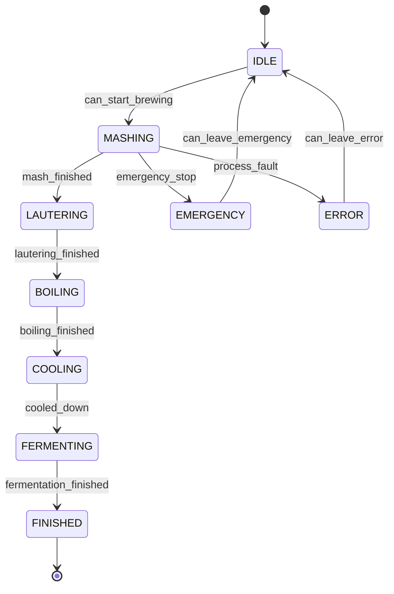

# Zustandsautomat Brauanlage

Referenz für Abgleich mit der SPS (Step7 / TIA) und für die Python-Implementierung.

**Code:** `fsm.py`, `states.py`, `guards.py`, `recipe.py`, `outputs.py`, `snapshot.py`

---

## Priorität pro Zyklus (`update`)

Jeder Aufruf prüft in dieser Reihenfolge:

1. `emergency_stop` → **EMERGENCY** (aus jedem Zustand)
2. Zustand **EMERGENCY** → ggf. **IDLE** (`can_leave_emergency`)
3. `process_fault` → **ERROR** (aus jedem normalen Zustand)
4. Zustand **ERROR** → ggf. **IDLE** (`can_leave_error`)
5. Normaler Prozessablauf (Tabelle unten)

---

## Übersicht (normaler Ablauf)



---

## Zustandstabelle

| Zustand | Eintritt (von) | Ausgang (nach) | Guard / Bedingung | Soll (Rezept) | Ausgänge |
|---------|----------------|----------------|-------------------|---------------|----------|
| **IDLE** | Start, EMERGENCY, ERROR | MASHING | `can_start_brewing` | – | alles aus |
| **MASHING** | IDLE | LAUTERING, EMERGENCY, ERROR | `mash_finished` / Not-Aus / Fehler | 65 °C, 3600 s | Heizung an |
| **LAUTERING** | MASHING | BOILING, EMERGENCY, ERROR | `lautering_finished` | 3600 s + Durchfluss | Pumpe + Ventil |
| **BOILING** | LAUTERING | COOLING, EMERGENCY, ERROR | `boiling_finished` | 100 °C, 3600 s | Heizung an |
| **COOLING** | BOILING | FERMENTING, EMERGENCY, ERROR | `cooled_down` | K3 ≤ 25 °C | alles aus |
| **FERMENTING** | COOLING | FINISHED, EMERGENCY, ERROR | `fermentation_finished` | 18 °C, 3600 s | Heizung an |
| **FINISHED** | FERMENTING | – (Endzustand) | – | – | alles aus |
| **EMERGENCY** | beliebig | IDLE | `can_leave_emergency` | – | alles aus |
| **ERROR** | beliebig | IDLE | `can_leave_error` | – | alles aus |

---

## Guards (Detail)

| Guard | Bedeutung |
|-------|-----------|
| `can_start_brewing` | `start_requested` **und** K1-Temp > 50 °C **und** K1-Füllstand ≥ 30 % |
| `mash_finished` | Zeit im Zustand ≥ Rezept-Dauer (MASHING) |
| `lautering_finished` | Zeit ≥ Dauer **und** `flow_rate` ≥ 0,5 |
| `boiling_finished` | Zeit ≥ Rezept-Dauer (BOILING) |
| `cooled_down` | K3-Temperatur ≤ `cooling_target` (25 °C) |
| `fermentation_finished` | Zeit ≥ Rezept-Dauer (FERMENTING) |
| `emergency_stop` | `snapshot.emergency_stop == True` |
| `can_leave_emergency` | Not-Aus aus **und** `acknowledge` |
| `process_fault` | Sensor defekt **oder** Temp/Füllstand außerhalb Grenzen |
| `can_leave_error` | kein Fehler mehr **und** `acknowledge` |

Grenzen: `config.py` (`MIN_TEMP`, `MAX_TEMP`, `MAX_LEVEL`, …)

---

## Snapshot → SPS (Beispiel-Mapping)

| Python (`ProcessSnapshot`) | Typische SPS-Variable |
|----------------------------|------------------------|
| `emergency_stop` | Not-Aus-Eingang |
| `start_requested` | Starttaste / Rezept aktiv |
| `acknowledge` | Quittierung Alarm |
| `sensor_ok` | Sensor OK |
| `k1_temperature` | K1_Temperatur |
| `k1_level` | K1_Füllstand |
| `k3_temperature` | K3_Temperatur |
| `flow_rate` | Durchfluss_NachgussMaische |
| `pump_on`, `valve_open` | Rückmeldungen Aktoren |

Ausgänge der FSM (`fsm.outputs`): `heater_on`, `pump_on`, `valve_open` → SPS-Ausgänge / Freigaben.

---

## Hauptschleife (Pseudocode SPS / Python)

```
snapshot = von_SPS_lesen()
old, new = fsm.update(snapshot, dt=ZYKLUSZEIT)
log_transition(fsm, old, new)

wenn fsm.outputs.heater_on:
    leistung = PID(fsm.temperature_setpoint, snapshot.k1_temperature)
sonst:
    leistung = 0

Pumpe  := fsm.outputs.pump_on
Ventil := fsm.outputs.valve_open
```

---

## Dateien

| Datei | Rolle |
|-------|--------|
| `states.py` | Zustands-Enum |
| `snapshot.py` | Eingänge pro Zyklus |
| `guards.py` | Übergangsbedingungen |
| `recipe.py` | Sollwerte pro Zustand |
| `outputs.py` | Stellbefehle pro Zustand |
| `fsm.py` | Zustandsautomat |
| `transition_log.py` | Logging bei Wechsel |
| `test_fsm.py` | Unit-Tests |
| `demo_run.py` | Demo-Ablauf |

Rezept und Grenzwerte anpassen: `recipe.py`, `config.py`.
