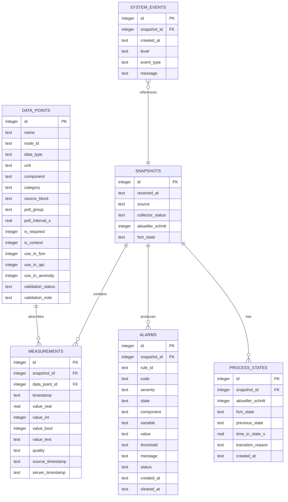

```mermaid id="b8pl73"
erDiagram
    DATA_POINTS ||--o{ MEASUREMENTS : describes
    SNAPSHOTS ||--o{ MEASUREMENTS : contains
    SNAPSHOTS ||--o{ ALARMS : produces
    SNAPSHOTS ||--o{ PROCESS_STATES : has
    SYSTEM_EVENTS }o--|| SNAPSHOTS : references

    DATA_POINTS {
        integer id PK
        text name
        text node_id
        text data_type
        text unit
        text component
        text category
        text source_block
        text poll_group
        real poll_interval_s
        integer is_required
        integer is_context
        integer use_in_fsm
        integer use_in_api
        integer use_in_anomaly
        text validation_status
        text validation_note
    }

    SNAPSHOTS {
        integer id PK
        text received_at
        text source
        text collector_status
        integer aktueller_schritt
        text fsm_state
    }

    MEASUREMENTS {
        integer id PK
        integer snapshot_id FK
        integer data_point_id FK
        text timestamp
        real value_real
        integer value_int
        integer value_bool
        text value_text
        text quality
        text source_timestamp
        text server_timestamp
    }

    PROCESS_STATES {
        integer id PK
        integer snapshot_id FK
        integer aktueller_schritt
        text fsm_state
        text previous_state
        real time_in_state_s
        text transition_reason
        text created_at
    }

    ALARMS {
        integer id PK
        integer snapshot_id FK
        text rule_id
        text code
        text severity
        text state
        text component
        text variable
        text value
        text threshold
        text message
        text status
        text created_at
        text cleared_at
    }

    SYSTEM_EVENTS {
        integer id PK
        integer snapshot_id FK
        text created_at
        text level
        text event_type
        text message
    }

```