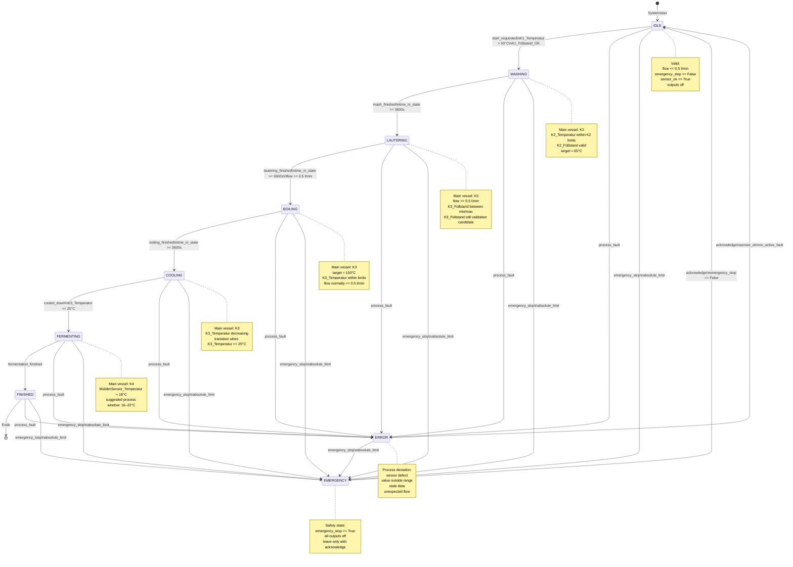

```mermaid
stateDiagram-v2
    [*] --> IDLE: Systemstart

    IDLE --> MASHING: start_requested\nK1_Temperatur > 50°C\nK1_Füllstand_OK

    MASHING --> LAUTERING: mash_finished\ntime_in_state >= 3600s

    LAUTERING --> BOILING: lautering_finished\ntime_in_state >= 3600s\nflow >= 0.5 l/min

    BOILING --> COOLING: boiling_finished\ntime_in_state >= 3600s

    COOLING --> FERMENTING: cooled_down\nK3_Temperatur <= 25°C

    FERMENTING --> FINISHED: fermentation_finished

    FINISHED --> [*]: Ende

    IDLE --> ERROR: process_fault
    MASHING --> ERROR: process_fault
    LAUTERING --> ERROR: process_fault
    BOILING --> ERROR: process_fault
    COOLING --> ERROR: process_fault
    FERMENTING --> ERROR: process_fault
    FINISHED --> ERROR: process_fault

    IDLE --> EMERGENCY: emergency_stop\nabsolute_limit
    MASHING --> EMERGENCY: emergency_stop\nabsolute_limit
    LAUTERING --> EMERGENCY: emergency_stop\nabsolute_limit
    BOILING --> EMERGENCY: emergency_stop\nabsolute_limit
    COOLING --> EMERGENCY: emergency_stop\nabsolute_limit
    FERMENTING --> EMERGENCY: emergency_stop\nabsolute_limit
    FINISHED --> EMERGENCY: emergency_stop\nabsolute_limit
    ERROR --> EMERGENCY: emergency_stop\nabsolute_limit

    ERROR --> IDLE: acknowledge\nsensor_ok\nno_active_fault

    EMERGENCY --> IDLE: acknowledge\nemergency_stop == False

    note right of IDLE
        Valid:
        flow <= 0.5 l/min
        emergency_stop == False
        sensor_ok == True
        outputs off
    end note

    note right of MASHING
        Main vessel: K2
        K2_Temperatur within K2 limits
        K2_Füllstand valid
        target ≈ 65°C
    end note

    note right of LAUTERING
        Main vessel: K3
        flow >= 0.5 l/min
        K3_Füllstand between min/max
        K3_Füllstand still validation candidate
    end note

    note right of BOILING
        Main vessel: K3
        target ≈ 100°C
        K3_Temperatur within limits
        flow normally <= 0.5 l/min
    end note

    note right of COOLING
        Main vessel: K3
        K3_Temperatur decreasing
        transition when K3_Temperatur <= 25°C
    end note

    note right of FERMENTING
        Main vessel: K4
        MobilerSensor_Temperatur ≈ 18°C
        suggested process window: 16–22°C
    end note

    note right of ERROR
        Process deviation:
        sensor defect
        value outside range
        stale data
        unexpected flow
    end note

    note right of EMERGENCY
        Safety state:
        emergency_stop == True
        all outputs off
        leave only with acknowledge
    end note

```